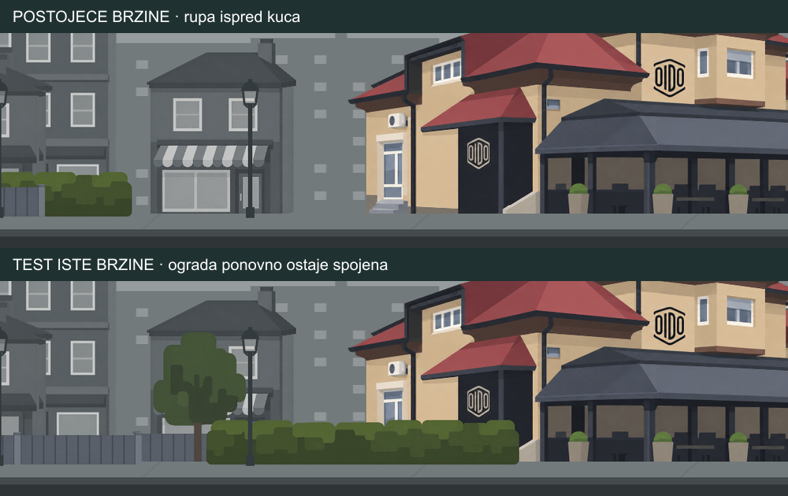
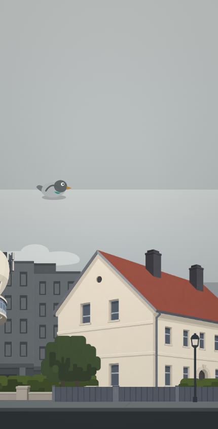

# Pregled igre — 17. 9. 2026.

**Najnovija dopuna nakon ponovnog pojavljivanja rupa i trzaja:** vidi [PARALLAX-NOVI-PRISTUP.md](PARALLAX-NOVI-PRISTUP.md). Dostavljeni novi `game.js` dodaje globalni sinus, ali ne uklanja staro razilaženje slojeva uz dostupni renderer. Novi prijedlog koristi zajednički period u svijetu i dosljednu projekciju po dubini, umjesto resetiranja faza. Ovo revidira raniji plan iz odjeljka 6; implementaciju ne nastavljati spajanjem oba pristupa. Raniji nalazi i izmjerene greške ostaju valjani. Nova arhitektura još nije implementirana ni testirana.

Pregledan projekt: `/Users/Juki/Documents/Codex/project`. Izvorne datoteke igre nisu mijenjane. Testovi učitavaju stvarni HTML, JS, renderer i JSON u Chromiumu, s ručno kontroliranom kamerom i vremenom. Usporedne promjene parallaxa postoje samo u memoriji testa.

**Aktualna dopuna za Hermes:** korisnik želi da se početni raspored vrati **isključivo izvan kadra**, bez sinusnog povratka vidljivih elemenata. Svaki novi prolaz kafića treba ponoviti isti raspored i isto ponašanje kao prethodni. Točna mjesta izmjene i uvjeti implementacije nalaze se u odjeljku **6**. To je specifikacija sljedeće izmjene, ne već implementirana ni testirana funkcionalnost. Raniji rezultati testova u ovom dokumentu odnose se na dostavljenu verziju igre.

## 1. Potvrđen uzrok rastuće rupe: međusobno pomicanje dijelova prednjeg plana

Lokacija: `assets/backgrounds/background.parallax.json`, `scene.layers`.

Petlja ima duljinu 4500 px. Svaki od 17 slojeva sadrži dva PNG dijela: 4096 i 404 px. Svih 34 slika uspješno je učitano. Njihovo ponavljanje u stvarnom rendereru ispravno je: svaki sloj vraća identične piksele pri istoj fazi nakon 1, 3 i 100 vlastitih perioda (51 provjera).

Međutim, međusobno nadopunjujući dijelovi ulice imaju različite brzine:

| ID sloja | Naziv | Parallax |
|---|---|---:|
| `trees` | Stabla i siva ograda | 0.71 |
| `house` | Kuća iza kafića | 0.74 |
| `cfb105b7-44de-4982-a88c-84f13653309b` | Kuće | 0.74 |
| `cafe` | Kafić | 0.78 |
| `hedge` | Živica i zid | 0.78 |
| `82c54401-398e-4a44-92df-d15f4860c269` | živica | 0.82 |
| `70818334-8b80-4ba9-860c-eb223415bda3` | Zivica I zidiac | 0.79 |
| `42111777-a740-486f-8194-a14ab98980f6` | lampe | 0.79 |

Na početku se ti elementi nadopunjuju. S vremenom jedan sloj otkrije prozirno područje drugog. To nije nestanak PNG-a niti pogrešan respawn cijelog backgrounda.

**Reprodukcija:** crtanje samo svih slojeva ograde/živice i kafića, mjerenje prozirnih mjesta na Y=585, u koordinatama scene:

| Kamera X | Ukupno nepokrivenih piksela u promatranom retku | Najduži pojedinačni razmak |
|---:|---:|---:|
| 0 | 37 | 32 |
| 4500 | 32 | 32 |
| 9000 | 178 | 146 |
| 13500 | 358 | 326 |
| 18000 | 492 | 341 |

Pri X=13500 nova praznina je na X=3335–3661. Kada se svim tim fizički povezanim dijelovima u memoriji dodijeli 0.78, ukupno nepokrivenih piksela ostaje 37 kroz sve navedene položaje; ne nastaje nova rastuća praznina. Početnih 37 px mjera je te izdvojene grupe slojeva, ne ukupne vidljive pozadine. Preko granice perioda dvije praznine mogu činiti jedan spojeni razmak.



**Preporuka za povezane elemente:** držati fizički povezanu ogradu, živicu i prolaz ispred kafića na istom parallaxu, npr. 0.78. Ako kuća iza kafića, ostale prepoznatljive građevine i lampe moraju zadržati isti raspored u odnosu na njih, staviti i njih u tu grupu. Za novu korisnikovu želju da se ponavlja i lokalno parallax ponašanje, koristiti odjeljak 6. Zadržavanje starog neograničenog `cameraX * layer.parallax` na nekim slojevima znači da se njihov raspored prema kafiću neće nužno ponavljati pri svakom njegovu prolazu.

Razmak se mijenja periodično s relativnim fazama; ne raste matematički bez granice. Ne rješavati ga resetiranjem kamere, dodavanjem proizvoljnog preklopa kopija ili skraćivanjem perioda 4500.

## 2. Zoom je ispravljen, ali otkriva prijelaz između dvaju neba

Lokacija: `src/game.js:253` (podložni gradijent) i `src/game.js:271` (pomak skalirane scene); izvezeni sloj `sky`.

U projektu je `ZOOM_BACKGROUND = 0.6` i nalazi se ispravljeni poziv renderera. Priloženi renderer ima izmjenu na jednoliko skaliranje s `Math.max(...)`, ali s ovim parametrima oba omjera daju istu skalu, pa se zoom više ne poništava.

Na kadru 430×844: konačna skala je približno 0.69945, vidljivi raspon 614.77 px scene, a razina tla ostaje na 789.14 px prikaza. Vrh PNG scene pomaknut je na približno Y=372.97. Tamo se neprozirni PNG neba s vlastitim gradijentom crta preko drukčijeg gradijenta ispod. Vidljiv je vodoravni prijelaz boje.



**Preporuka:** nebo tretirati kao jednu podlogu koja ne ovisi o zoomu. Najjednostavnije je pri crtanju preskočiti izvezeni sloj `sky` i koristiti jedan gradijent preko cijelog ekrana, dok sunce, oblaci i grad ostaju odvojeni. Druga mogućnost je produžiti točnu boju gornjeg ruba PNG-a iznad njega, umjesto crtanja različitog gradijenta. Ne popravljati to ponovnim rastezanjem cijele scene po visini.

## 3. Postojeći test pozadine uopće se ne izvršava do provjera

Lokacija: `tests/background-smoke.mjs:6`.

Test pokušava otvoriti `assets/backgrounds/Moj-grad.parallax.json`, a projekt sadrži `background.parallax.json`. Pokretanje završava s ENOENT. Ispraviti putanju. Čak i nakon toga test provjerava samo da se poziva crtanje i da je skala jednolika; ne provjerava stvarno pokrivanje, faze slojeva ili rupe. Dodati provjeru izgleda kroz vrijeme i izoliranih slojeva.

## 4. Tonijevo praćenje igrača ovisi o broju frameova

Lokacija: `src/enemies.js:7`.

Izraz `t.y += Math.max(-120, Math.min(120, player.y - t.y))` dopušta pomak od 120 px **po frameu**, umjesto po sekundi. U testu praćenja igrača na Y=600 iz Y=0, nakon istih 1/30 sekunde Toni je na Y=120 pri 30 FPS, Y=240 pri 60 FPS i Y=480 pri 120 FPS.

**Preporuka:** ograničenje izraziti kroz `dt`, primjerice `maxStep = followSpeed * dt`, zatim pomak ograničiti na ±maxStep. Željenu brzinu odabrati kao postavku igre. Ovo nije uzrok rupe u pozadini, ali jest potvrđena razlika ponašanja između uređaja.

## 5. Resize tijekom pauze premješta igrača

Lokacija: `src/game.js:77`.

Uvjet `this.state !== STATE.PLAYING` uključuje stanje PAUSED. Svaki resize u pauzi prepisuje X i Y igrača na početnu lokaciju. U testu je položaj (123, 200) nakon resizea bez promjene dimenzija postao (107.5, 371.36).

**Preporuka:** početno centriranje ograničiti na početni ekran/završenu rundu; pri pauzi sačuvati trenutni položaj. Za stvarnu promjenu veličine zaslona definirati odvojeno preslikavanje ili ograničavanje položaja i primijeniti ga dosljedno za pauzu i aktivnu igru.

## 6. Nova specifikacija: povrat početnih pozicija isključivo izvan kadra

### Željeno ponašanje

- Svaka kopija bloka grada kreće od istog spremljenog rasporeda i prolazi kroz isti slijed pomicanja. Pojava sljedećeg kafića ne smije naslijediti pomak skupljen tijekom prošlih blokova.
- Nema sinusnog vraćanja, globalnog skoka pozicija, resetiranja kamere ni pomicanja vidljivih elemenata unatrag radi pripreme sljedećeg kruga.
- Stara kopija može se vratiti na početni raspored i reciklirati tek kada je cijela izašla iz vidljivog područja. Sljedeća kopija mora već biti pripremljena izvan desnog ruba prije ulaska.
- Povezani elementi (ograda, živica, kafić i pripadajuća kuća) moraju zadržati zajednički pomak i tijekom vidljivog prolaza. Reset izvan kadra **sam po sebi ne zatvara rupe nastale unutar vidljivog prolaza**.

### Gdje izmijeniti kod

Brojevi linija odnose se na pregledanu verziju; Hermes neka se ravna i prema imenima funkcija.

1. **`assets/backgrounds/renderer.js:8` — `instances()` i `:30–39` — petlja crtanja u `render()`.** Glavna izmjena je ovdje. Trenutačno svaki sloj neovisno određuje kopije koristeći `offset = cameraX * l.parallax` na liniji 32. Za novi režim treba zajednički identitet kopije bloka, zajednički položaj bloka i lokalno stanje te kopije. Ne dodavati samo `% 4500` na postojeći pomak i ne resetirati sve slojeve pri prolasku kafića. Time se ne rješava razlika njihovih faza, a reset vidljivih dijelova proizvodi skok.
2. **`src/game.js:52–54` — priprema stanja pozadine u konstruktoru; `:83` — `start()`.** Uvesti zasebno stanje instanci pozadine ili instancu kontrolera, npr. `this.backgroundState`. Postaviti ga nakon učitavanja projekta, a pri početku nove runde resetirati. Točne linije nakon novih umetanja prirodno će se promijeniti. `loadParallaxBackground()` je mjesto za izradu početnog rasporeda iz učitanog JSON-a.
3. **`src/game.js:273–283` — poziv `ParallaxRuntime.render()`.** Proslijediti stanje/kontroler i konfiguraciju novog načina ponavljanja kroz dodatnu opciju, primjerice `backgroundState`. Ostaviti postojeći ispravljeni `ZOOM_BACKGROUND`, jednoliku skalu, sidrenje tla, `viewportWidth: this.width / scale` i `clear: false`. `worldX` ostaje kontinuiran; ne resetira se svakih 4500 px.
4. **`src/game.js:68` — `resize()` te promjena zooma.** Ponovno izračunati raspon kadra i potreban broj kopija. Ne resetirati lokalno stanje vidljive kopije zbog resizea ili promjene zooma. Pri širem kadru najprije osigurati dodatne kopije, uključujući područje koje tek postaje vidljivo.
5. **`assets/backgrounds/background.parallax.json` — podaci, ne izvršni kod.** Učitati ga kao nepromjenjivi predložak rasporeda. Postojeće slike, dimenzije i period ostaju uporabljivi. Konfiguraciju grupa i ograničenih pomaka staviti u kod ili zasebnu konfiguraciju; ne popravljati koordinate svakog framea u izvornom JSON-u.

Ovdje se **ne mijenja** renderer u mapi našeg editora: igra stvarno učitava `project/assets/backgrounds/renderer.js` kroz `project/index.html`. `rendering.rendererSource` u JSON-u je referentni tekst i igra ga trenutačno ne izvršava. Popravak samo tog teksta neće promijeniti igru.

### Organizacija ponavljajućih blokova

Koristiti zajednički `L = scene.loop.end - scene.loop.start` (4500) i zajednički pomak grada, npr. `cityTravel = worldX * 0.78`. Za logičku kopiju s indeksom `k` referentni početak je:

```js
blockX = k * L - cityTravel;
screenSceneX = blockX + originalX + localOffset;
```

Sve vrijednosti gore su u pikselima scene, prije zooma. Svaka kopija ima vlastiti identitet `k`, lokalni napredak i lokalne pomake. Svi njeni slojevi dijele taj identitet: susjedni kafić nije novi nezavisni događaj za svaki sloj. Poželjno je lokalno ponašanje računati deterministički iz položaja kopije prema kameri, a ne zbrajanjem pomaka svaki frame. Tako promjena FPS-a ne mijenja raspored i ponovljeni poziv `draw()` ne pomiče scenu dodatno.

**Oba PNG dijela istog sloja pripadaju istoj kopiji:** dio na X=0 širine 4096 i dio na X=4096 širine 404. Ne resetirati ih odvojeno niti računati ciklus prema širini pojedinog PNG-a. Također ne dijeliti kopije usred objekta samo zato što je granica izvoznog PNG-a na X=4096.

Izvorni raspored kopirati iz predloška, ne iz završnih koordinata prethodne kopije. Kopije dijele već učitane slike; ne dekodirati ponovno PNG-ove za svaki blok. Početno stanje bloka 0 treba odgovarati prvom vidljivom kadru, a sljedeći blokovi prolaziti istu lokalnu putanju pri istom položaju kafića. Uvođenje novog sustava usred aktivne runde treba izbjeći; primijeniti ga od početka nove runde.

### Siguran povrat izvan kadra

Vidljivi interval u koordinatama scene je `[0, viewportWidth]`, gdje je `viewportWidth = this.width / scale`. Dodati sigurnosnu marginu i maksimalni dopušteni lokalni pomak, npr. `margin` i `maxLocalOffset`. Provjeravati stvarne pomaknute granice svih dijelova kopije ili konzervativnu granicu cijelog bloka proširenu za taj pomak.

- Kopija izlijevo smije se ukloniti/reciklirati samo ako je **njen najdesniji rub < -margin**. Nestanak kafića sam nije dovoljan: iza njega mogu ostati druge zgrade iste kopije.
- Nakon inicijalizacije nove kopije početni raspored mora još biti **u cijelosti desno od `viewportWidth + margin`**. Ne prebaciti staru kopiju izravno na granicu vidljivosti ako bi dio objekta već bio na ekranu.
- Dok su kraj stare i početak nove kopije istodobno u kadru, crtati obje sa svojim stanjem. Nikakav zajednički reset ne smije promijeniti staru vidljivu kopiju.
- Ne pretpostaviti da su dovoljne dvije kopije. Potreban broj ovisi o zoomu, širini kadra, margini i lokalnom pomaku; okvirno `ceil((viewportWidth + 2 * margin + 2 * maxLocalOffset) / L) + 2`. Konačnu pokrivenost odrediti iz granica kopija.
- Za kopije koje bi zbog širenja kadra trebale već biti vidljive izračunati stanje iz njihova lokalnog napretka; ne počinjati od nule usred kadra. Predviđena putanja mora biti neovisna o trenutku alokacije objekta u poolu.

### Kako zadržati osjećaj dubine bez novih rupa

Resetiranje tek izvan kadra rješava nakupljanje pomaka kroz ponavljanja, ali ne jamči da će dvije različite brzine unutar jednog bloka ostati spojene. Zato:

- **Čvrsta ulica:** kafić, pripadajuća kuća, živice, zidovi, ograde i ostali objekti koji trebaju stalno ostati u tom rasporedu koriste isti zajednički pomak. Mogu ostati zasebni slojevi radi redoslijeda crtanja. Njihov `localOffset` treba biti zajednički, najjednostavnije 0.
- **Neovisna dekoracija/dubina:** dozvoliti mali, ograničen lokalni pomak unutar svake kopije. Putanja mora biti ista za svaki `k` pri istom lokalnom napretku. Ne koristiti globalni akumulirani `worldX * (oldParallax - baseSpeed)` bez lokalnog ograničenja. Ne vraćati pomak dok je kopija vidljiva; vraća se tek pri recikliranju izvan kadra.
- **Spoj blokova i pune podloge:** pomicanje cijelog rasteriziranog sloja lijevo/desno može otkriti rub unutar njegovih 4500 px. Ne pokušavati to sakriti praznim pomicanjem sljedeće kopije ili clippingom koji odsiječe vidljivu kuću. Za slojeve koji moraju biti puni treba nepomičan zajednički sloj pokrivanja, pravilno pripremljeno preklapanje/produženi rubovi ili redizajn asseta. Ako to nije dostupno, za takav sloj koristiti zajednički pomak bez lokalnog drifta. Postojeći PNG-ovi su izrezani točno na granicama; nemaju zajamčene dodatne rubove za proizvoljan drift.
- **Nebo:** zasebna podloga kadra bez recikliranja i bez lokalnog pomaka. Za korisnikov cilj da svaki prolaz izgleda kao prvi, i oblake/udaljeni grad uključiti u deterministički ciklus blokova; ne ostaviti ih na staroj nezavisnoj beskonačnoj fazi. Posebno tretirati kontinuirane podloge kako je opisano iznad; ne obećavati očuvanje svih izvornih različitih stalnih brzina i istodobno identičan kadar pri svakom kafiću.

Kod trenutačnog izvoza kuće i druga dekoracija unutar sloja spojeni su u PNG. Može se upravljati slojem/kopijom bloka, ali ne resetirati samo jedno stablo unutar te slike. Za neovisno recikliranje pojedinačnih objekata potreban je puni projekt sa zasebnim elementima ili novi izvoz tih elemenata.

**Preporučeni prvi korak:** uvesti zajedničke kopije i fiksni raspored čvrste ulice, zatim dodavati ograničen lokalni parallax samo slojevima kojima su granice i pokrivanje prikladni. Ne zadržavati stare različite stalne brzine svih slojeva uz obećanje da će reset izvan kadra sam spriječiti rupe.

### Kriteriji prihvaćanja za Hermes

Ovo su upute za buduću provjeru, **nisu novi testovi pokrenuti ovom dopunom**:

1. Snimiti isti trenutak dolaska kafića u prolazima 1, 2, 3 i 100. Pozadina mora imati isti raspored pri istoj fazi; iz usporedbe isključiti gameplay likove i HUD.
2. Pregledati i sredinu prolaza, ne samo početak: ograda i živica ostaju spojene, kuća ne ulazi na mjesto kafića.
3. Usporiti prikaz oko ulaska/izlaska kopije. Nikakav vidljiv objekt ne smije skočiti zbog recikliranja. Bilježiti uvjet potpunog izlaska cijele kopije.
4. Provjeriti granice PNG dijelova 4096/404 i blokova 4500, zoom 1, 0.75, 0.6 i 0.5 te kadar širi od jednog bloka. Sve vidljive kopije moraju biti nacrtane.
5. Pauza i ponovni `draw()` ne smiju mijenjati pozicije. Resize/zoom ne smiju vratiti vidljivu kopiju na početak. Nova runda treba ponoviti izvorni početni raspored.

## Potencijalni rizik na mobitelima: memorija slika

34 PNG-a imaju ukupno 55,386,000 piksela. Jedna potpuno dekodirana RGBA kopija iznosi približno 211 MiB, prije dodatnih GPU kopija i platna. JSON od oko 5.2 MiB zato nije mjera potrebne radne memorije. Nije zabilježen pad ili gubitak konteksta u ovom testu; ovo je rizik koji treba profilirati na ciljanom mobitelu. Moguća optimizacija je uklanjanje praznih slika i izrezivanje velikih prozirnih površina uz ispravno ažuriranje položaja, dimenzija i očuvanje zajedničkog perioda 4500.

## Što je prošlo

- Učitavanje svih 34 slika pozadine i tri dodatna lika.
- Nema JS pogrešaka ni neuspjelih lokalnih zahtjeva pri učitavanju i kontroliranom crtanju.
- Svih 17 slojeva vraća iste piksele nakon 1, 3 i 100 vlastitih perioda.
- Dijelovi 4096 + 404 ostaju jedan period od 4500.
- Trenutni poziv zooma odgovara trenutnom rendereru i ostavlja razinu tla na mjestu.
- Kontrolirano izjednačavanje brzina potvrđuje uzrok razdvajanja ograde/živice.

Dokazi i ponovljivost: `audit.cjs`, `results.json`, `test-log.txt`, PNG usporedbe u ovoj mapi. Ovo nije potpuna validacija svih kombinacija gameplaya ili svih mobilnih preglednika; testirani su stvarni asseti, pozadina, zoom i navedeni reproducirani problemi.
